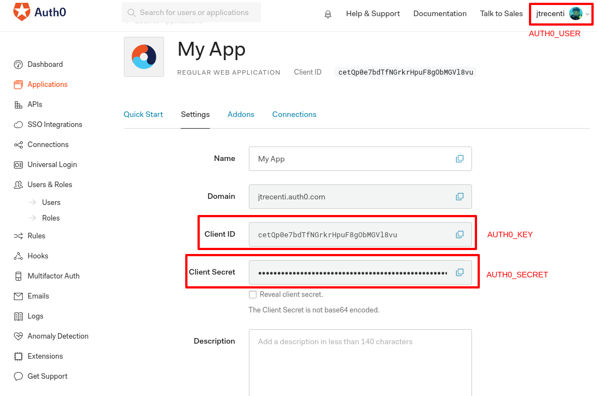

# auth0 <a href='https:/curso-r.github.io/auth0'></a>

[](https://travis-ci.org/curso-r/auth0) [](https://ci.appveyor.com/project/curso-r/auth0) [](https://cran.r-project.org/package=auth0)

The goal of `{auth0}` is to implement an authentication scheme to Shiny using OAuth Apps through the freemium service [Auth0](https://auth0.com).

## Installation

You can install `{auth0}` from CRAN with:

``` r
install.packages("auth0")
```

You can also install the development version from github with:

``` r
# install.packages("devtools")
remotes::install_github("curso-r/auth0")
```

## Tutorial

To create your authenticated shiny app, you need to follow the five steps below.

### Step 1: Create an Auth0 account

- Go to [auth0.com](https://auth0.com)
- Click "Sign Up"
- You can create an account with a user name and password combination, or by signing up with your GitHub or Google accounts.

### Step 2: Create an Auth0 application

After logging into Auth0, you will see a page like this:


- Click on "+ Create Application"
- Give a name to your app
- Select "Regular Web Applications" and click "Create"

### Step 3: Configure your application

- Go to the Settings in your selected application. You should see a page like this:


- Add `http://localhost:8080` to the "Allowed Callback URLs", "Allowed Web Origins" and "Allowed Logout URLs".
    - You can change `http://localhost:8080` to another port.
- Add the remote server where you are going to deploy your shiny app to the same boxes.
    - Just make sure that these addresses are correct. If you are placing your app inside a folder (e.g. https://johndoe.shinyapps.io/fooBar), don't include the folder (`fooBar`) in "Allowed Web Origins".
- Click "Save"

Now let's go to R!

### Step 4: Create your shiny app and fill the `_auth0.yml` file

- Create a configuration file for your shiny app by calling `auth0::use_auth0()`:

```r
auth0::use_auth0()
```

- You can set the directory where this file will be created using the `path=` parameter. See `?auth0::use_auth0` for details.
- Your `_auth0.yml` file should be like this:


```yml
name: myApp
remote_url: ''
auth0_config:
  api_url: !expr paste0('https://', Sys.getenv("AUTH0_USER"), '.auth0.com')
  credentials:
    key: !expr Sys.getenv("AUTH0_KEY")
    secret: !expr Sys.getenv("AUTH0_SECRET")
```

- Run `usethis::edit_r_environ()` and add these three environment variables:

```
AUTH0_USER=johndoe
AUTH0_KEY=5wugt0W...
AUTH0_SECRET=rcaJ0p8...
```

There's how you identify each of them (see the image below):

- `AUTH0_USER` is your username, which can be found on the top corner of the site.
- `AUTH0_KEY` is your Client ID, which can be copied from inside the app page.
- `AUTH0_SECRET` is your Client Secret, which can be copied from the app page.



More about environment variables [here](https://csgillespie.github.io/efficientR/set-up.html#renviron). You can also fill these information directly in the `_auth0.yml` file (see below). If you do so, don't forget to save the `_auth0.yml` file after editing it.

- Save and **restart your session**.
- Write a simple shiny app in a `app.R` file, like this:

```r
library(shiny)

ui <- fluidPage(
  fluidRow(plotOutput("plot"))
)
  
server <- function(input, output, session) {
  output$plot <- renderPlot({
    plot(1:10)
  })
}

# note that here we're using a different version of shinyApp!
auth0::shinyAppAuth0(ui, server)
```

**Note**: If you want to use a different path to the `auth0` configuration file, you can either pass it to `shinyAppAuth0()` or set the `auth0_config_file` option by running `options(auth0_config_file = "path/to/file")`.

### Step 5: Run!

You can try your app running

```r
options(shiny.port = 8080)
shiny::runApp("app/directory/")
```

If everything is OK, you should be forwarded to a login page and, after logging in or signing up, you'll be redirected to your app.

If you are running your app in a remote server like shinyapps.io or your own server, and if your app is in a subfolder of the host (like https://johndoe.shinyapps.io/fooBar), you must include your remote URL in the `remote_url` parameter in the `_auth0.yml` file. 

You can also force `{auth0}` to use the local URL setting `options(auth0_local = TRUE)`. This can useful if you're running an app inside a Docker container. 

--------------------------------------------------------------------------------

## Environment variables and multiple Auth0 apps

If you are using `{auth0}` for just one shiny app or you are running many apps for the same user database, the recommended workflow is using the environment variables `AUTH0_KEY` and `AUTH0_SECRET`.

However, if you are running many shiny apps and want to use different login settings, you must create many Auth0 apps. Hence, you'll have many Cliend IDs and Client Secrets to use. n this case, global environment variables will be unproductive because you'll need to change them every time you change the app you are developing.

There are two options in this case:

- (Recommended) Add environment variables inside the repository of your application, using `usethis::edit_r_environ("project")`.
- (Not recommended) Add the Client ID and Secret directly in the _auth0.yml file:

The best option in this case is to simply add the Client ID and Secret directly in the `_auth0.yml` file:

```yml
name: myApp
remote_url: ''
auth0_config:
  api_url: https://<USERNAME>.auth0.com
  credentials:
    key: <CLIENT_ID>
    secret: <CLIENT_SECRET>
```

Example:

```yml
name: myApp
remote_url: ''
auth0_config:
  api_url: https://johndoe.auth0.com
  credentials:
    key: cetQp0e7bdTNGrkrHpuF8gObMVl8vu
    secret: C6GHFa22mfliojqPyKP_5K0ml4TituWrOhYvLdTa7veIyEU3Q10R_-If-7Sh6Tc
```

Although possible, the latter option is less secure and consequently not recommended because it's easy to forget passwords there and commit them in public repositories, for example.

--------------------------------------------------------------------------------

## `ui.R`/`server.R`

To make `{auth0}` work using an `ui.R`/`server.R` framework, you'll need to wrap your `ui` object/function with `auth0_ui()` and your `server` function with `auth0_server()`. Here's a small working example:

### ui.R

```r
library(shiny)
library(auth0)

auth0_ui(fluidPage(logoutButton()))
```

### server.R

```r
library(auth0)

auth0_server(function(input, output, session) {})
```

`{auth0}` will try to find the `_auth0.yml` using the same strategy than the `app.R` framework: first from `options(auth0_config_file = "path/to/file")` and then fixing `"./_auth0.yml"`. Both `auth0_ui()` and `auth0_server()` have a `info=` parameter where you can pass either the path of the `_auth0.yml` file or the object returned by `auth0_info()` function.


--------------------------------------------------------------------------------

## Audience parameter

To authorize a client to make API calls against a remote server, the authorization request should include an `audience` parameter 
([Auth0 documentation](https://auth0.com/docs/flows/guides/auth-code/call-api-auth-code#example-authorization-url)).

To do this with `{auth0}`, add an `audience` parameter to the `auth0_config`
section of your `_auth0.yml` file. For example:

```yml
name: myApp
remote_url: ''
auth0_config:
  api_url: !expr paste0('https://', Sys.getenv("AUTH0_USER"), '.auth0.com')
  audience: https://example.com/api
  credentials:
    key: !expr Sys.getenv("AUTH0_KEY")
    secret: !expr Sys.getenv("AUTH0_SECRET")
```

When an `audience` parameter is included in the request, the 
[access token](https://auth0.com/docs/tokens)
returned by Auth0 will be a JWT access token rather than an opaque access token.
The client must include the access token with API requests to authenticate
the requests.

--------------------------------------------------------------------------------

## RStudio limitations

Because RStudio is specialized in standard shiny apps, some features do not work as expected when using `{auth0}`. The main issues are is that you must run the app in a real browser, like Chrome or Firefox. If you use the RStudio Viewer or run the app in a RStudio window, the app will show a blank page and won't work.

If you're using a version lower than 1.2 in RStudio, the "Run App" button may not appear in the right corner of the app.R script. That's because RStudio searches for the "shinyApp(" term in the code to identify a shiny app.

--------------------------------------------------------------------------------

## Bookmarking

Since v0.2.0, `auth0` supports shiny's state bookmarking, but because of URL parsing issues, bookmarking only works with server storage. To activate this feature, you must call the app with the following lines in your `app.R` file:

```r
enableBookmarking(store = "server")
shinyAppAuth0(ui, server)
```

Also note that Auth0 adds `code` and `state` to the URL query parameters. 

This solution works normally in the `ui.R`/`server.R` framework.

--------------------------------------------------------------------------------

## Managing users

You can manage user access from the Users panel in Auth0. To create a user, click on "+ Create users".

You can also use many different OAuth providers like Google, Facebook, Github etc. To configure them, go to the *Connections* tab. 

In the near future, our plan is to implement Auth0's API in R so that you can manage your app using R.

--------------------------------------------------------------------------------

## Logged information

After a user logs in, it's possible to access the current user's information using the `session$userData$auth0_info` reactive object. The Auth0 token
can be accessed using `session$userData$auth0_credentials`. 
Here is a small example:

```r
library(shiny)
library(auth0)

# simple UI with user info
ui <- fluidPage(
  verbatimTextOutput("user_info")
  verbatimTextOutput("credential_info")
)

server <- function(input, output, session) {

  # print user info
  output$user_info <- renderPrint({
    session$userData$auth0_info
  })
  
  output$credential_info <- renderPrint({
    session$userData$auth0_credentials
  })

}

shinyAppAuth0(ui, server)
```

You should see objects containing the user and credential info.

**User info**

```
$sub
[1] "auth0|5c06a3aa119c392e85234f"

$nickname
[1] "jtrecenti"

$name
[1] "jtrecenti@email.com"

$picture
[1] "https://s.gravatar.com/avatar/1f344274fc21315479d2f2147b9d8614?s=480&r=pg&d=https%3A%2F%2Fcdn.auth0.com%2Favatars%2Fjt.png"

$updated_at
[1] "2019-02-13T10:33:06.141Z"
```

Note that the `sub` field is unique and can be used for many purposes, like creating customized apps for different users.

**Credential info (abridged)**

```
$access_token
[1] "y5Yv..."

$id_token
[1] "eyJ0..."

$scope
[1] "openid profile"

$expires_in
[1] 86400

$token_type
[1] "Bearer"
```

The `id_token` may be used with applications that require an `Authorization`
header with each web request.

### Logged information and ui.R/server.R

If you're running `{auth0}` using `ui.R/server.R` framework and you want to access logged information, you'll need to use the same object returned `auth0_info()` function in both `auth0_ui()` and `auth0_server()`.

This is possible using the `global.R` file. For example:

#### global.R

```r
a0_info <- auth0::auth0_info()
```

#### ui.R

```r
library(shiny)
library(auth0)

auth0_ui(fluidPage(), info = a0_info)
```

#### server.R

```r
library(auth0)

auth0_server(function(input, output, session) {

  observe({ 
    print(session$userData$auth0_info) 
  })
  
}, info = a0_info)
```

--------------------------------------------------------------------------------

## Logout

You can add a logout button to your app using `logoutButton()`.

```r
library(shiny)
library(auth0)

# simple UI with logout button
ui <- fluidPage(logoutButton())
server <- function(input, output, session) {}
shinyAppAuth0(ui, server)
```

--------------------------------------------------------------------------------

## Costs

Auth0 is a freemium service. The free account lets you have up to 7000 connections in one month and two types of social connections. You can check all the plans [here](https://auth0.com/pricing).

## Disclaimer

This package is not provided nor endorsed by Auth0 Inc. Use it at your own risk.

Also, I am NOT a security expert, and as [Bob Rudis pointed out](https://twitter.com/hrbrmstr/status/1175924379412307970), adding the word "secure" on something has broad implications of efficacy and completeness. So this package may be lying when it tells it's secure. 

If you're a security expert and liked the idea of this package, please consider testing it. We'll be really, really grateful for any help.

--------------------------------------------------------------------------------

## Roadmap

### `{auth0}` 0.2.0

- [✔] Remove the need for local and remote URLs in the `config_file`.
- [✔] Solve bookmarking and URL parameters issue (Issue #22).
- [✔] `shinyAppDirAuth0()` function to work as `shiny::shinyAppDir()` (Issue #21).
- [✔] Support to `ui.R`/`server.R` apps.

### `{auth0}` 0.3.0

- [ ] Implement `{auth0}` API functions to manage users and login options throusgh R.
- [✔] Hex sticker.

--------------------------------------------------------------------------------

## Licence

MIT
